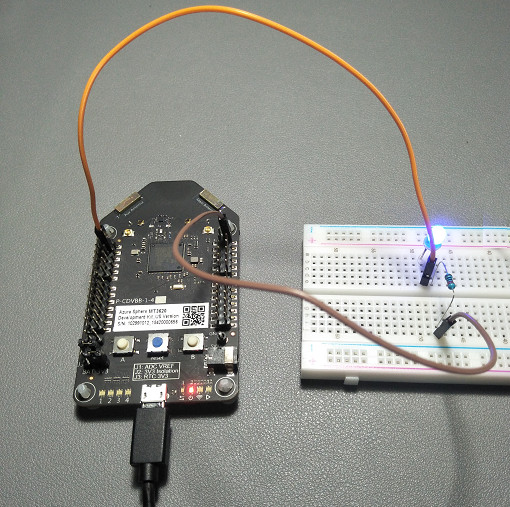

# Blinking LED light

This sample makes a LED light blink.

## Required parts

| Part | Count |
|---------|---------|
| LED    | 1 |
| Resistor 220Ω  
| 1 | 
| Jumper (M-to-F)  
| 2 |

## Required pins

| Pin | Purpose |
|---------|---------|
| Header 1 Pin 4 | GPIO output|
| Header 3 Pin 2 | Ground |

## Circuit

## Notes (in case you needed them)

* The longer leg of a LED is the positive pole.
* You can connect to any GND pins