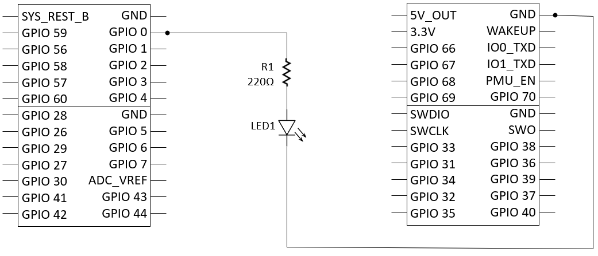

# Counter on 7-segment Display

This sample displays number 0 through F in a loop on a 7-segment display.

## Required parts
| Part | Count |
|---------|---------|
| 7-segemnt display 
| 1 |
| 74HC595 
| 1 |
| Resistor 220Ω  
| 8 | 
| Jumper (M-to-F)  
| 5 |
| Jumper (M-to-M)  
| 13 |

## Required pins

| Pin | Purpose |
|---------|---------|
| Header 1 Pin 4 | GPIO output|
| Header 1 Pin 6 | GPIO output|
| Header 1 Pin 8 | GPIO output|

## Circuit

## Notes (in case you needed them)

* The longer leg of a LED is the positive pole.
* You can connect to any GND pins
