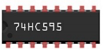

# Counter on 7-segment Display

This sample displays number 0 through F in a loop on a 7-segment display.

## Required parts
| Part | Count |
|---------|---------|
| 7-segemnt display 
| 1 |
| 74HC595 
| 1 |
| Resistor 220Ω  
| 8 | 
| Jumper (M-to-F)  
| 5 |
| Jumper (M-to-M)  
| 13 |

## Required pins

| Pin | Purpose |
|---------|---------|
| Header 1 Pin 4 | GPIO output|
| Header 1 Pin 6 | GPIO output|
| Header 1 Pin 8 | GPIO output|

## Circuit

## Notes (in case you needed them)

* **74HC595** is a chip that converts serial data into a byte. You send serial data through the **DS** port, and the output bits can be read from **Q0** to **Q7** ports. To write the bits, you first set **ST_CP** to *LOW*. Then, for each bit, you set **SH_CP** to *LOW*, write the bit to **DS**, and then set **SH_CP** to *HIGH*. Once you've written all bits, set **ST_CP** to *HIGH* to update the output ports.
* The **QE** port on the **74HC595** needs to be grounded to enable output ports.