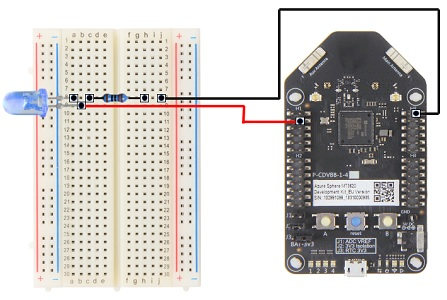
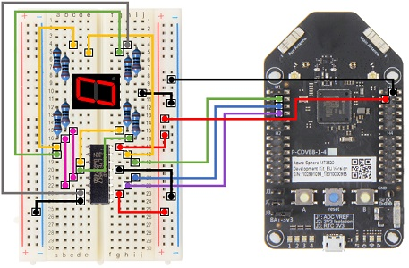

# Azure Sphere Scenarios
This repository contains a series of sample scenarios of [Azure Sphere]( https://azure.microsoft.com/en-us/services/azure-sphere/) operating various small circuits such as LED lights, motors and joysticks. 

I take a lot of inspiration from www.freenove.com building up this repository. Some project source code is directly ported from their samples and tutorials.

The repository assumes you have basic circuit knowledge such as voltage, current and Ohm’s law. However, it does not require you to have prior knowledge on how to operate specific parts such as step motors and 7-segment displays.

## Prerequisites
To try out the samples in this repository, you’ll need:
* [Visual Studio Code]( https://code.visualstudio.com/)
*  [Azure Sphere SDK]( https://docs.microsoft.com/en-us/azure-sphere/install/install-sdk)
* [Claim]( https://docs.microsoft.com/en-us/azure-sphere/install/claim-device) your Azure Sphere device 	
* An Azure Sphere device such as [MT3620]( https://www.mediatek.com/products/AIoT/mt3620)  - this is the device I tested with

## Running the code
To launch a sample scenario, open the scenario folder with Visual Studio Code, and press **F5** or **Ctrl + F5** (without debugger) while the device is attached to USB.

To clean up, use Azure Spher CLI command:

```bash
azshpere device sideload delete
```

## Scenarios

| Scenario | Circuit |
|--------|--------|
|[**Blinking LED light**](Blinking_LED/README.md) <br/>Make a LED light blink at certain frequency| [](imgs/blinking_led.png)|
|[**7-segment Display Counter**](Counter_7SegmentDisplay/README.md) <br />Couunting from 0 to F on a 7-segment display| [](imgs/7_segment_display.jpg)|

